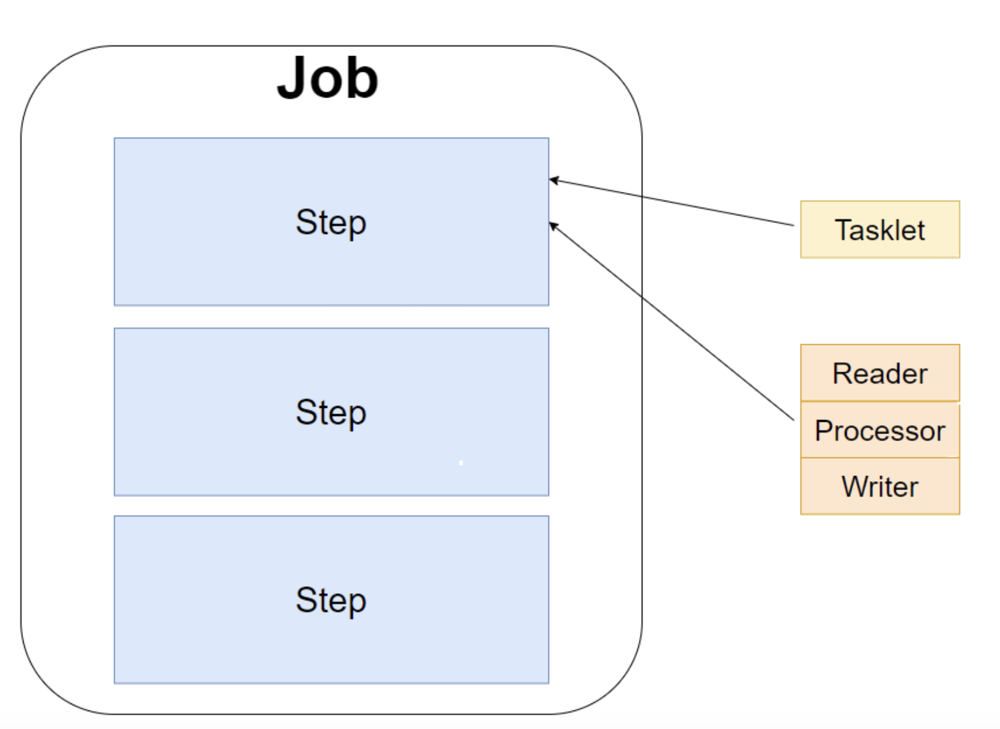
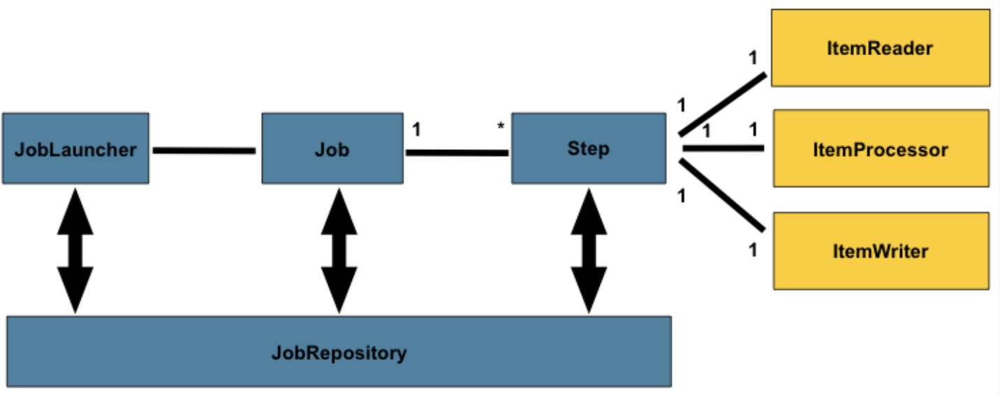

## Spring Batch
* Batch 작업이란 데이터를 실시간으로 처리하는 것이 아닌 일괄적으로 모아 처리하는 것이다
* Batch Application 이라는 개념은 사용량이 적은 시간대에
특정 대용량 데이터 처리 등의 빈번하지 않은 비즈니스 로직들을 단발성으로 처리하는 애플리케이션이다

### 조건
1. 대용량 데이터 처리 가능
    * 대량의 데이터를 읽거나 조작하는 등, 특정 처리 로직을 수행할 수 있어야 한다
2. 자동화 기능
    * 실행 후 개발자의 관여 없이도 스스로 반복적으로 작동할 수 있어야 한다
3. 신뢰 기능
    * 수행 중 문제가 발생하였을 때에 로깅 등의 형태로 에러를 추적할 수 있어야 한다
4. 견고한 구조
    * 로직 수행 중 예외적인 데이터나 상황에 대해 중단 없이 처리할 수 있어야 한다
5. 성능
    * 예상한 자원 내에 작업을 처리해야 하며, 다른 애플리케이션의 성능에 영향을 미치지 않아야 한다

### 구성 요소
* Job 
    * 가장 큰 단위로 Batch 단위이다
* Step
    * 내부에서 각 로직 처리 부분에 해당한다

    * Step 내의 작업 단위는 ```Tasklet``` 또는 [```Reader```, ```Processor```, ```Writer```]의 구성의 단위로 구성된다



### 처리 방식
* Job은 하나의 작업 단위를 의미하며, 아래와 같은 형태로 동작한다

    * Spring Boot에서 Batch 작업은 JobRepository를 통해 인스턴스화 되며, ```JobLauncher```를 통해 구동된다

* Spring에서 ```@EnableBatchProcessing``` 어노테이션을 사용하면 6가지 요소들을 개발자가 사용할 수 있게 된다
    * JobRepository
    * JobLauncher
    * JobRegistry
    * PlatformTransactionManager
    * JobBuilderFactory
    * StepBuilderFactory